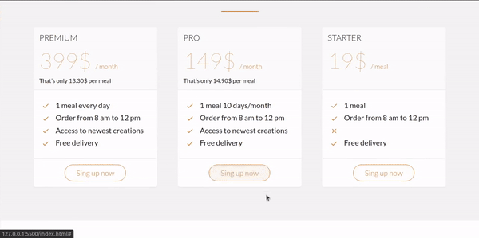

<h1 align="center">
Omnifood Webpage
</h1>

This is a study case of a food delivery web page

[//]: # 
  
  

## About this Project
[//]: #

The Omnifood project is a Udemy project from a course that I took to learn about the basics of HTML and CSS. Omnifood is a delivery company, with annual, monthly and daily plans, that provides health meals!

## WHY
[//]: #
Take course projects such as this one help me develop my skills as a web developer. I always try to understand the why things are build in such a way, that helps me to search for more information and I can understand completely the technology I’m studying.

This project is part of my personal portifolio, so, I’ll be glad if you can provide any feedback! 

Connect with me on [LinkedIn](https://www.linkedin.com/in/matheus-almeida-9989b9177/). 

## OBSERVATIONS
[//]: #
**I don’t use CSS FLEXBOX in this project.**
Has a said before, the whole purpose was to understand HTML and CSS Basic (selectors, fonts, backgrounds, buttons, etc…)
I know Flexbox make our lives way more easier, and I don’t need a grid file for the columns when i use flexbox.

## MY JOURNEY
[//]: #
even this being a course project, I try to extract the most knowledgment possible from bouth technologies (HTML & CSS) 

For me, the complexity of understand the functionalities of structure and style is low, the development don’t require logic. The essential is to know the tags, elements, selectors and properties.

The most difficult part was to apply the best practise for the structure of my code. I always try to write a clean and understandable code, that can be performatic and peoples can read. My main concern was not to repeat the code for the same elements in the differents sections. 

**GIT**

I also used basic git to controll the versions of my code and do commits  

